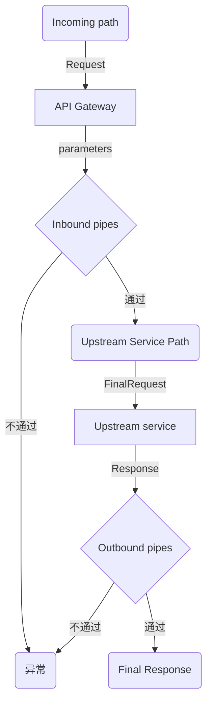

## 背景说明

API网关的作用不言而喻，在微服务架构下多个微服务接口需要一个网关来协调，从而实现拦截器、代理转发、流量控制、负载均衡、熔断等机制；有许多成熟的第三方网关中间件，比如[Zuul](https://github.com/Netflix/zuul), [Kong](https://docs.konghq.com/2.0.x)等，如果没有一个可配置化的方式去管理路由，则每新增一个接口就要到API服务中增加相应的代码，从而达到代理转发请求到后端服务的目的，导致开发人员要分别维护微服务和API网关两套代码，繁琐而低效。

当然，在不想引入第三方网关组件的情况下，我们还是可以自己来手写一个简单的网关组件，从而实现配置化的路由管理功能，大致思路如下：

1. 路由配置：通过配置文件管理微服务的路由
2. 实现代理：用户请求 -> 输入拦截 -> 服务发现 -> 向上游转发请求 -> 输出拦截 -> 返回信息
3. 监听路由：通过`Flask.route`函数注册路由，绑定每个路由的代理

<!-- more -->

这个过程大致如下所示：



## 设计与配置声明

为了明确从API网关服务到上游微服务的代理路由，我们需要声明一个路由，这个路由中需要明确以下信息：

1. API Gateway中开放的接口 (incoming path)
2. 上游服务的接口 (upstream path)
3. 支持的HTTP请求方法列表
4. 上游服务名称（service name）

从这个四元组，我们就可以确定一条路由（从哪来，到哪去）

另外，输入输出的一系列拦截器可以抽象为inbound/outbound管道：

* pipelines
  * inbound
  * outbound

那么我们就可以明确所需的配置项如下:

```yaml

routes:

    - name: {route_name}  # 路由名称
      service_name: {service_name} # 后端服务名称
      methods:
        - {http method}  # 路由方法：GET|PUT|POST|DELETE
      path:  /incoming/path/<param_1>/<param_2>/ # 客户端请求的资源路径（incoming）
      upstream_path:  /upstream/path/<param_1>/<param_2>/ # 上游服务器的资源路径
      pipelines:
        inbound:
            - name: inbound pipe name
              properties: {}  # inbound pipe properties
        outbound:
            - name: outbound pipe name
              properties: {}  # outbound pipe properties
```

配置项说明：

* name: (string) 路由名称
* service_name: (string) 内部微服务名称（如 `resolver` `data_manager` 等，只要内部去实现通过服务名获取服务地址即可）
* methods: (array) 路由请求方法列表, 如 `['GET', 'PUT']`
* path: (string) 匹配的路径，使用`flask`的占位符 `<parameter_name>` 声明路径参数（为了简化逻辑，服务名称固定使用 `<service_name>` 占位符）
* upstream_path: (string) 转发到上游服务的路径，与`path`使用同样风格的参数占位符
* pipelines: (object) 请求处理管道，包含请求前处理(inbound)各请求后处理(outbound)， 支持自定义数据处理器和处理顺序，从而实现自定义的拦截、数据转换等一系列操作
  * inbound: (array) 代理发送请求前，会使用`inbound`中定义的handlers处理用户请求中的参数，比如对headers中的auth字段验证，对用户请求的url做鉴权处理
  * outbound: (array) 代理获得上游服务的response之后，使用`outbound`中的定义的handlers处理返回值，比如转换 status code

## 代码实现

### 1. 创建一个`Route`类用于载入路由配置

```python
class Route(object):
    """
    路由实体类，对应一项路由配置
    TODO replace_placeholder 函数，替换字符串中的占位符
    TODO extract_placeholders 函数，获取字符串中的点位符
    TODO get_pipe 函数，通过handler name获取对应的PipeHandler类 
    """

    SERVICE_NAME_PLACEHOLDER = 'service_name'

    def __init__(self, name, service_name, methods, path, upstream_path, pipelines=None):
        """
        :param str name: (string) 路由名称
        :param str service_name: (string) 内部微服务名称（如 `resolver` `data_manager` 等）
        :param list methods: (array) 支持的请求方法列表, 如 `['GET', 'PUT']`
        :param str path: (string) 匹配的路径，使用`flask`的占位符 `<parameter_name>` 声明路径参数，服务名称固定使用 `<service_name>` 占位符
        :param str upstream_path: (string) 转发到上游服务的路径，与`path`使用同样风格的参数占位符
        :param dict pipelines: (object) 数据处理管道
        """

        if not isinstance(methods, (list, set, tuple)):
            raise ValueError("methods must be an iterable list")
        pipelines = pipelines or {}

        self.name = name
        self.service_name = service_name
        self.methods = list(set(methods))
        # 使用 replace_placeholder 将 <service_name> 替换为路由配置中的后端服务
        self.path = replace_placeholder(path, self.SERVICE_NAME_PLACEHOLDER, service_name)
        self.upstream_path = replace_placeholder(upstream_path, self.SERVICE_NAME_PLACEHOLDER, service_name)
        self.pipelines = {
            "inbound": map(self.init_pipe_handler, pipelines.get('inbound') or []),
            "outbound": map(self.init_pipe_handler, pipelines.get('outbound') or []),
        }

        # 导出上游服务资源所需的参数（占位符）
        self.upstream_params = extract_placeholders(self.upstream_path)

    @staticmethod
    def init_pipe_handler(pipe_conf):
        try:
            name = pipe_conf['name']
            properties = pipe_conf.get('properties', {})
            klass = get_pipe(name)
            return klass(**properties)
        except Exception as e:
            raise ValueError("illegal pipe config {}: {}".format(pipe_conf, e))

    @property
    def inbound_pipes(self):
        return self.pipelines.get("inbound") or []

    @property
    def outbound_pipes(self):
        return self.pipelines.get("outbound") or []

    @staticmethod
    def load(routes):
        """

        :param list of dict routes: 路由配置列表
        :rtype: list of Route
        """
        return map(lambda kv: Route(**kv), routes)
```

实现TODO中的工具函数

```python
import re
import sys

_URL_PLACEHOLDER_PATTERN = re.compile('<(.*?)>')


def get_pipe(name):
    """通过 mod.ClassName 导入自定义的PipeHandler"""
    module_name, obj_name = name.rsplit('.', 1)
    __import__(module_name)
    module = sys.modules[module_name]
    obj = getattr(module, obj_name)
    return obj


def extract_placeholders(url):
    """
    >>> res = extract_placeholders("/<service_name>/resource/<resource_id>/submit/")
    >>> assert set(res) == {"service_name", "resource_id"}
    :param url: request url name
    :return: list of placeholder name
    """
    return _URL_PLACEHOLDER_PATTERN.findall(url)


def replace_placeholder(url, placeholder_name, value):
    return url.replace('<{}>'.format(placeholder_name), str(value))

```

### 2. 实现代理网关的逻辑

代理网关就是要实现接受请求、请求信息过滤（鉴权、参数处理等）、服务发现、发送代理请求、返回信息过滤、异常处理、返回请求结果这样的数据流处理路径


因为涉及到请求、返回和异常信息的处理（query, data, form, headers, exception等），需要定义拦截器管道如下:

```python
class ExceptionHandler(object):
    """异常处理器，可以自行实现错误的捕获、熔断、服务降级等"""

    def __init__(self, decorator=None):
        if not decorator:
            return
        # 使用自定义装饰器覆盖
        self.decorator = decorator

    def handle(self, e, *args, **kwargs):
        """异常处理
        :param e:
        :param args: request args
        :param kwargs: request kwargs
        :return: tuple(content, status, headers)
        :rtype: tuple
        """
        raise NotImplementedError

    def decorator(self, func):

        @functools.wraps(func)
        def wrapper(*args, **kwargs):
            try:
                return func(*args, **kwargs)
            except Exception as e:
                logger.debug("Exception handle")
                return self.handle(e, *args, **kwargs)

        return wrapper


class InboundHandler(object):
    """输入处理管道，可自定义一系列拦截器处理请求信息，如验证、鉴权、数据解码、参数包装等"""
    __metaclass__ = ABCMeta

    def handle(self, request, *args, **kwargs):
        """
        :param dict request: 请求信息 (初始：url, parameters, data, method)，可根据需要添加
        :return: (request, args, kwargs)
        """
        raise NotImplementedError

    def __call__(self, request, *args, **kwargs):
        return self.handle(request, *args, **kwargs)


class OutboundHandler(object):
    """输出处理管道，可自定义一系列拦截器处理返回信息，如返回码处理、数据编码等"""
    __metaclass__ = ABCMeta

    def handle(self, response, headers, status, content, *args, **kwargs):
        """
        :param requests.Response response: origin http response
        :param dict headers: the response headers which will be responded
        :param int status: the status code which will be responded
        :param str content: the content which will be responded
        :return: tuple(headers, status, content)
        """
        raise NotImplementedError

    def __call__(self, response, *args, **kwargs):
        return self.handle(response, *args, **kwargs)

```

这样我们就可以很方便地构造一个这样的处理管道:

```python
try:

@exception_handler.decorator
def proxy_request(request):
    upstream_req_info = get_upstream_request_info(request)
    # inbound process
    for pipe_handler in route.inbound_pipes:  # type: InboundHandler
        upstream_req_info, args, kwargs = pipe_handler(upstream_req_info, *args, **kwargs)
    # proxy request
    resp = requests.request(**upstream_req_info)
    # outbound process
    for pipe_handler in route.outbound_pipes:  # type: OutboundHandler
        headers, status, content = pipe_handler(resp, headers, status, content, *args, **kwargs)
    return content, status, headers

```

顺着这个思路，网关的实现就很简单：

```python
import requests
from flask import make_response
from flask import request


class NoopExceptionHandler(ExceptionHandler):

    DEFAULT_CONTENT = {
        "error_code": "InternalServerError",
        "error_message": "",
        "error_message_chs": "服务器内部错误"
    }

    def handle(self, e, *args, **kwargs):
        logger.exception("Unknown exception occurred: %s", e)
        content = dict(self.DEFAULT_CONTENT)
        content['error_message'] = e.message
        return json.dumps(content), 500


class GenericGateway(object):

    def __init__(self, app, routes, url_supplier, exception_handler=None):
        """

        :param app: flask app
        :type app: flask.Flask
        :param routes: 路由列表
        :type routes: list of Route
        :param url_supplier: 服务名称解析函数，通过service name获取service url: url_supplier(service_name) -> service_url
        :type url_supplier: function
        :param exception_handler: exception handle decorator
        :type exception_handler: ExceptionHandler
        """
        if not callable(url_supplier):
            raise ValueError("service url supplier (url_supplier) must be callabe")

        self.app = app
        self.routes = routes
        self.url_supplier = url_supplier
        self.exception_handler = exception_handler or NoopExceptionHandler()
        self.proxy_list = []

    def get_url(self, service_name):
        try:
            return self.url_supplier(service_name)
        except Exception as e:
            logger.warning("Failed to get the url of service: %s", service_name, exc_info=True)
            raise RuntimeError("Failed to get the url of service {}: {}".format(service_name, e))

    def create_request_proxy(self, route):

        logger.info("Register route: %s", route.path)

        @self.exception_handler.decorator
        def proxy_request(*args, **kwargs):

            upstream_path = route.upstream_path
            for p_name in route.upstream_params:
                v = get_params_from_context(p_name, kwargs)
                upstream_path = utils.replace_placeholder(upstream_path, p_name, v)

            endpoint = self.get_url(route.service_name)

            final_url = "{}{}".format(endpoint, upstream_path)
            upstream_req_info = dict(
                url=final_url,
                method=request.method,
                params=request.args,
                data=request.data,
                files=request.files,
                headers=request.headers,
            )
            if request.form:
                upstream_req_info['data'] = request.form

            for pipe_handler in route.inbound_pipes:
                upstream_req_info, args, kwargs = pipe_handler(upstream_req_info, *args, **kwargs)

            content_type = upstream_req_info['headers'].get('Content-Type')
            if content_type and 'boundary' in content_type:
                # requests prepare body时，会使重新生成 boundary，headers中旧的 boundary 会导致上游服务无法识别
                upstream_req_info['headers'] = {k: v for k, v in upstream_req_info['headers'].items()}
                upstream_req_info['headers'].pop('Content-Type', None)
                upstream_req_info['headers'].pop('content-type', None)
            resp = requests.request(**upstream_req_info)
            status = resp.status_code
            content = None
            headers = resp.headers

            for pipe_handler in route.outbound_pipes:
                headers, status, content = pipe_handler(resp, headers, status, content, *args, **kwargs)

            content = make_response(content or resp.content)
            for h_name, h_value in (headers or {}).items():
                content.headers[h_name] = h_value

            return content, status

        # 修改函数名称：Flask route注册使用func name必须唯一
        proxy_request.__name__ = route.name
        return proxy_request

    def _register_route(self, route):
        """
        :param Route route:
        """
        proxy = self.create_request_proxy(route)
        self.proxy_list.append(
            self.app.route(route.path, methods=route.methods)(proxy)
        )

    def register_routes(self):
        for route in self.routes:
            self._register_route(route)


def get_params_from_context(param_name, kwargs):
    """按顺序尝试从url参数、headers、args、form、json中获取参数值
    """
    payload = {}

    if kwargs and kwargs.get(param_name):
        payload = kwargs
    elif request.headers.get(param_name):
        payload = request.headers
    elif request.args and request.args.get(param_name):
        payload = request.args
    elif request.form and request.form.get(param_name):
        payload = request.form
    elif request.data:
        body = json.loads(request.data)
        if body and body.get(param_name):
            payload = body

    try:
        return payload[param_name]
    except KeyError as e:
        raise InvalidParameterException(
            message="Missing the required params: {}".format(e),
            message_chs="缺少必要的参数 {}".format(e)
        )

```

## 测试网关代理功能

使用unittest简单地验证一下我们的网关有没有问题：


```python
import json
import unittest

import flask
import mock


class TestGateway(unittest.TestCase):

    def setUp(self):
        self.app = flask.Flask("testing")
        self.url_map = {
            "mock-server": "http://127.0.0.1"
        }
        self.url_supplier = lambda x: self.url_map[x]

        self.app.route("/hello", methods=["GET"])(lambda: "world")

        route_1 = {
            "name": "submit-resource",
            "service_name": "mock-server",
            "methods": ["POST"],
            "path": "/accounts/<account>/users/<user>/projects/<project>/<service_name>/resource/"
                    "<resource_id>/submit/",
            "upstream_path": "/v1/resource/<resource_id>/submit/",
        }

        route_2 = {
            "name": "resource_management",
            "service_name": "mock-server",
            "methods": ["PUT", "DELETE"],
            "path": "/accounts/<account>/users/<user>/projects/<project>/<service_name>/resource/"
                    "<resource_id>/",
            "upstream_path": "/v1/resource/<resource_id>/",
        }

        route_3 = {
            "name": "resource_access",
            "service_name": "mock-server",
            "methods": ["GET"],
            "path": "/accounts/<account>/users/<user>/projects/<project>/<service_name>/resource/"
                    "<resource_id>/",
            "upstream_path": "/v1/resource/<resource_id>/",
        }
        self.routes = Route.load([route_1, route_2, route_3])

    def test_app(self):
        client = self.app.test_client()
        resp = client.get("/hello")
        self.assertEqual(200, resp.status_code)

    def test_multi_routes(self, mock_request):
        mock_resp = mock.MagicMock()
        mock_request.return_value = mock_resp
        routes = self.routes

        gateway = GenericGateway(self.app, routes, url_supplier=self.url_supplier)
        gateway.register_routes()

        mock_resp.status_code = 200
        mock_resp.content = b"success"
        params = {
            "account": "testaccount",
            "user": "admin",
            "project": "default",
            "resource_id": "test-resource-id"
        }
        data = {"test_k": "test_v"}

        client = self.app.test_client()

        # POST:/accounts/testaccount/users/admin/projects/default/mock-server/resource/test-resource-id/submit/
        resource = self.replace_placeholders(gateway.routes[0].path, params)
        res = client.post(resource, json=data)
        self.assertEqual(200, res.status_code)
        self.assertEqual(mock_resp.content, res.data)
        proxy_req_params = mock_request.call_args[1]
        self.assertEqual(json.dumps(data), proxy_req_params['data'])
        self.assertEqual('http://127.0.0.1/v1/resource/test-resource-id/submit/', proxy_req_params['url'])

        # POST:/accounts/testaccount/users/admin/projects/default/mock-server/resource/test-resource-id/
        resource = self.replace_placeholders(gateway.routes[1].path, params)
        res = client.post(resource, json=data)
        self.assertEqual(405, res.status_code)
        proxy_req_params = mock_request.call_args[1]
        self.assertEqual(json.dumps(data), proxy_req_params['data'])

        # PUT:/accounts/testaccount/users/admin/projects/default/mock-server/resource/test-resource-id/
        res = client.put(resource, json=data)
        self.assertEqual(200, res.status_code)
        self.assertEqual(mock_resp.content, res.data)
        proxy_req_params = mock_request.call_args[1]
        self.assertEqual(json.dumps(data), proxy_req_params['data'])
        self.assertEqual('http://127.0.0.1/v1/resource/test-resource-id/', proxy_req_params['url'])

        # DELETE:/accounts/testaccount/users/admin/projects/default/mock-server/resource/test-resource-id/
        res = client.delete(resource, json=data)
        self.assertEqual(200, res.status_code)
        self.assertEqual(mock_resp.content, res.data)
        proxy_req_params = mock_request.call_args[1]
        self.assertEqual(json.dumps(data), proxy_req_params['data'])
        self.assertEqual('http://127.0.0.1/v1/resource/test-resource-id/', proxy_req_params['url'])

        # GET:/accounts/testaccount/users/admin/projects/default/mock-server/resource/test-resource-id/
        res = client.get(resource)
        self.assertEqual(200, res.status_code)
        self.assertEqual(mock_resp.content, res.data)

```

## BTW

这个Python实现的网关虽然简单明了，但只是在数据流上大致抽象了一个通用网关中间件的处理流程，但是本身是在WSGI程序的基础上构建的，在性能上是有很大的限制的，有时间还是要尝试使用Golang、Java从底层开始实现一遍，才能体会到IO多路复用等优化带来的性能提升。
